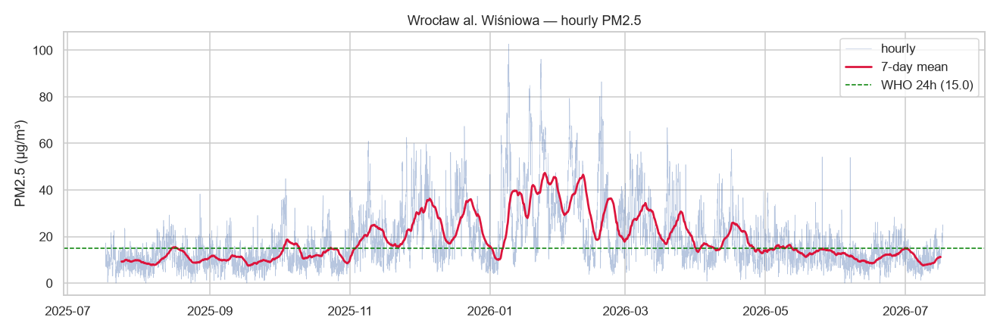
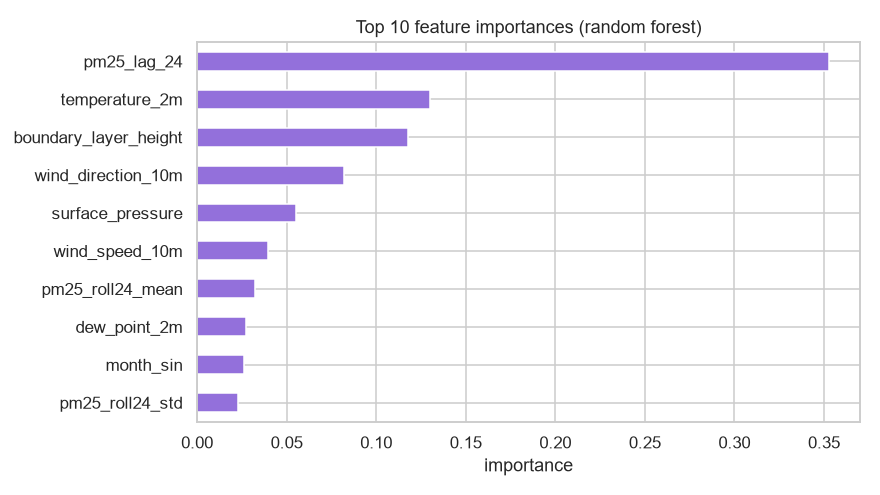

# wroclaw-air-insights

[](https://github.com/P0w3r223/wroclaw-air-insights/actions/workflows/ci.yml)

**Air quality analysis for Wrocław from open GIOŚ data** — an ingestion pipeline, a
SQL database, an insights report, and a **24-hour PM2.5 forecast**.

> Portfolio project A1. Demonstrates pandas, SQL, visualization, working with public
> APIs, and a first scikit-learn model built with correct time-series methodology
> (a time-based split rather than a random one — a common junior mistake this project
> deliberately avoids).

## What it does

1. **Ingest** — pulls hourly PM2.5 for Wrocław stations directly from the GIOŚ API
   (live + up to a year of history) and hourly weather from Open-Meteo.
2. **Store** — writes tidy measurements into a local SQLite database.
3. **Analyze** — a notebook with a question → analysis → conclusion narrative:
   seasonality, station comparison, and exceedances of air-quality norms.
4. **Forecast** — predicts PM2.5 24 hours ahead using time + weather features, and
   reports how much it beats a naive baseline.

## Data sources

| Data | Source | License / attribution |
|------|--------|-----------------------|
| PM2.5 measurements (Wrocław) | [GIOŚ](https://powietrze.gios.gov.pl/pjp/content/api) — Główny Inspektorat Ochrony Środowiska | Public sector information — source: GIOŚ |
| Weather (history + forecast) | [Open-Meteo](https://open-meteo.com) (CAMS) | CC BY 4.0 — Open-Meteo + CAMS |

See [`docs/research/data-sources.md`](docs/research/data-sources.md) for station ids,
endpoint details, and the reasoning behind these choices.

## Results

Hourly PM2.5 shows the expected strong seasonality — low in summer, peaking in the
winter heating season, when the WHO 24-hour guideline is regularly exceeded:



**24-hour forecast vs. baseline** (chronological test split, ~1 year of hourly data):

| Metric | Model (random forest) | Baseline (persistence) |
|--------|:---------------------:|:----------------------:|
| MAE (µg/m³)  | **4.14** | 4.87 |
| RMSE (µg/m³) | **5.40** | 6.41 |

The model lowers MAE by **~15%** versus the naive baseline. Feature importances show it
relies on recent PM2.5 (autocorrelation) plus dispersion drivers — boundary-layer
height, wind, temperature — so it learns the physics rather than memorizing noise:



The full narrative analysis — seasonality, norm exceedances, an hour × weekday heatmap,
and weather correlations — is in
[`notebooks/01_analysis.ipynb`](notebooks/01_analysis.ipynb).

> Note: the test window falls in summer (low, stable PM2.5), so R² is modest even
> though MAE clearly beats the baseline; see the notebook's *Limitations* section.

## Project structure

```
src/wroclaw_air_insights/   # config, ingest (gios/weather), db, clean, forecast
notebooks/                  # 01_analysis.ipynb — EDA + figures
tests/                      # pytest — cleaning & feature logic
docs/research/              # data-source research and decisions
reports/figures/            # generated charts used in this README
```

## Setup

```bash
python -m venv .venv
# Windows:
.venv/Scripts/python -m pip install -r requirements.txt
# Linux/macOS:
# source .venv/bin/activate && pip install -r requirements.txt
```

## Usage

```bash
# fetch ~1 year of PM2.5 + weather into SQLite, then train + evaluate
python -m wroclaw_air_insights.pipeline all --days 365
# or run the steps separately:
python -m wroclaw_air_insights.pipeline ingest --days 365
python -m wroclaw_air_insights.pipeline train

pytest                      # run the test suite

# reproduce the analysis notebook (figures + outputs)
jupyter nbconvert --to notebook --execute --inplace notebooks/01_analysis.ipynb
```

## Methodology highlights

- **Time-based split** for training and evaluation — no future leakage.
- **Baseline comparison** — the model is reported against a naive persistence
  baseline, with the improvement quantified.
- **Explicit missing-data handling** — station gaps are treated, not ignored.

## License

MIT. Air-quality data © GIOŚ; weather data © Open-Meteo / CAMS (CC BY 4.0).
