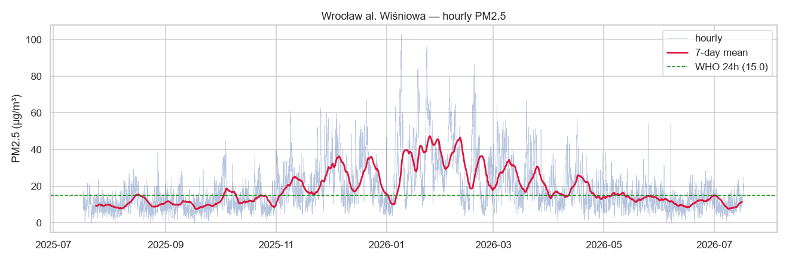
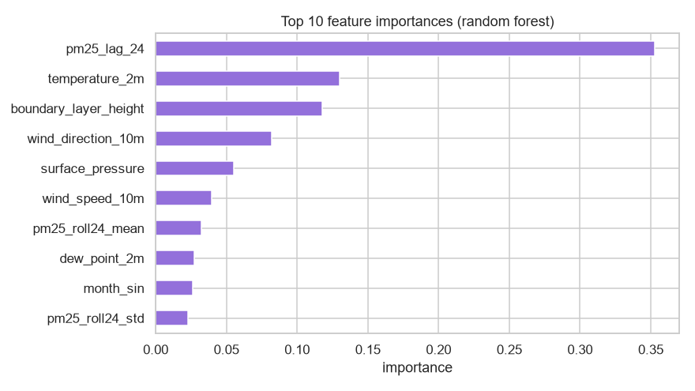

# wroclaw-air-insights

[](https://github.com/P0w3r223/wroclaw-air-insights/actions/workflows/ci.yml)

**Air quality analysis for Wrocław from open GIOŚ data** — an ingestion pipeline, a
SQL database, an insights report, and a **24-hour PM2.5 forecast**.

> Portfolio project A1. Demonstrates pandas, SQL, visualization, working with public
> APIs, and a first scikit-learn model built with correct time-series methodology
> (a time-based split rather than a random one — a common junior mistake this project
> deliberately avoids).

## What it does

1. **Ingest** — pulls hourly measurements for every pollutant a Wrocław station reports
   (PM2.5, NO2, CO) directly from the GIOŚ API (live + up to a year of history), plus the
   current air-quality index, and hourly weather from Open-Meteo.
2. **Store** — writes tidy measurements into a local SQLite database.
3. **Analyze** — a notebook with a question → analysis → conclusion narrative:
   seasonality, exceedances of air-quality norms, and cross-pollutant/weather relations.
4. **Forecast** — predicts PM2.5 24 hours ahead from time + weather features, compares
   several models against naive baselines (single split **and** rolling-origin CV), and
   serves a **live next-24h forecast** from the saved bundle. The bundle carries a per-lead
   policy and three predictors, because no single one wins the whole chart: the naive rule
   answers the earliest hours, a predictor fitted for one specific lead answers a measured
   middle band, and the 24-hour model answers the rest.
5. **Publish** — a scheduled GitHub Actions job refreshes the data daily and deploys an
   HTML report (live forecast + the station's PM2.5 air-quality index) to GitHub Pages,
   with every figure on it recomputed from that run rather than carried over.
6. **Grade itself afterwards** — every forecast the page publishes is appended to an
   append-only log on a separate `forecast-log` branch, and scored once the hours it
   describes have been measured. That is the only evidence here that was fixed *before*
   the outcome existed; every other figure, cross-validation included, scores hours that
   had already happened.

## Data sources

| Data | Source | License / attribution |
|------|--------|-----------------------|
| PM2.5 measurements (Wrocław) | [GIOŚ](https://powietrze.gios.gov.pl/pjp/content/api) — Główny Inspektorat Ochrony Środowiska | Public sector information — source: GIOŚ |
| Weather (history + forecast) | [Open-Meteo](https://open-meteo.com) (CAMS) | CC BY 4.0 — Open-Meteo + CAMS |

See [`docs/research/data-sources.md`](docs/research/data-sources.md) for station ids,
endpoint details, and the reasoning behind these choices.

## Results

> **About the figures below.** The pipeline retrains daily on a rolling year, so every number
> here moves. These come from **one run** — 8 584 hourly rows, 2025-07-24 → 2026-07-17,
> held-out window 2026-05-06 → 2026-07-17 — and they are quoted as a dated record, not as the
> current state of the deployed model. The [live page](https://p0w3r223.github.io/wroclaw-air-insights/)
> recomputes the headline error, the model-vs-naive gap, the model selection, the lead axis and
> the clean/elevated split on every refresh — that is where to read what they come out to today.
> The candidate comparison and the importance tables are one-off measurements kept here
> instead, re-runnable with `pipeline compare`, `pipeline importance` and `pipeline ab` — the
> last of which reproduces both published null results, which until recently were bespoke
> scripts no command could re-run. The reasoning behind each is in
> [`docs/ideas/0001_report_roadmap.md`](docs/ideas/0001_report_roadmap.md). Where a *decision*
> rather than a number can move with the data, the text below describes how the decision is
> made and leaves the answer to the page.

Hourly PM2.5 shows the expected strong seasonality — low in summer, peaking in the
winter heating season, when the WHO 24-hour guideline is regularly exceeded:



**24-hour forecast — models vs. baselines** (chronological test split, the dated run above):

| Model | MAE (µg/m³) | RMSE (µg/m³) | R² |
|-------|:-----------:|:------------:|:--:|
| **HistGradientBoosting** | **3.64** | **4.81** | **0.23** |
| RandomForest | 4.15 | 5.42 | 0.02 |
| baseline (persistence) | 4.87 | 6.41 | −0.37 |
| baseline (seasonal) | 5.95 | 7.70 | −0.98 |
| Ridge | 5.60 | 7.06 | −0.66 |

On that window gradient boosting lowers MAE by ~25% versus the naive persistence baseline.
**Year-round the figure is 19.1%** — 6.97 against the naive rule's 8.61 µg/m³, both scored
on the same rolling folds. The published page leads with the year-round figure whatever it
comes out to, because the split's number is a summer one, and quoting it beside an
all-seasons error credits the model with a season it was not tested across. The gap held
**fold by fold, 5 of 5** (mean +1.64 µg/m³), which is what makes it a result rather than an
average that one hard winter fold could be carrying. The page publishes the year-round gap as
a percentage; the fold tally behind it is visible in the lead table further down, whose +24 h
row is this same comparison.

**The pipeline picks the model itself**, and it picks on rolling-origin cross-validation,
never on the split above — choosing a winner on the rows the report then publishes would
turn those figures into a best-of-three rather than an honest estimate. CV MAE across the
year on that run: HistGradientBoosting **6.97**, RandomForest 7.18, Ridge 8.19.

How close is that? The question is settled by the **per-fold difference**, not by comparing
the gap to the ±2.5 swing between folds — that swing is seasonal and common to every
candidate, so testing against it would call the model's own 1.64 win over the naive rule a
null too. Paired, on that run: gradient boosting beats RandomForest on 4 folds of 5 (+0.21,
losing the first) and Ridge on 4 of 5 with the second fold a **tie** — those two land 0.003 µg/m³
apart there, below the precision the published report prints, and counting that as a fold won
would be the same overclaim one level down.

*How* close the top two are is a per-run answer, and the page gives it — the selection note
states the paired margin and the fold tally that run produced. On the run above the honest
summary was "close", and for the right reason rather than the tempting one: not because 6.97
and 7.18 look similar, but because the winner changed hands on one fold in five. Since the
pipeline retrains daily on a rolling year, that can read differently on the next run, and the
published report always names the model it actually used.

**One error figure was describing twenty-four different tasks.** The model is trained on a
single task — predict 24 hours ahead — and the lead time is not one of its inputs. It cannot
be: every feature is anchored at the hour being predicted, so the rows for "+1h" and "+24h"
at the same valid time are the *same row*. The model's error is therefore not approximately
flat across the published chart, it is exactly constant. The naive reference is not:

| Lead | Model MAE | Naive MAE | Paired Δ | Folds won | Served by |
|------|:---------:|:---------:|:--------:|:---------:|:---------:|
| +1 h  | 6.97 | **3.75** | −3.22 | 0/5 | naive rule |
| +3 h  | 6.97 | **5.51** | −1.45 | 1/5 | naive rule |
| +6 h  | 6.97 | 7.20 | +0.23 | 2/5 | naive rule |
| +12 h | **6.97** | 8.51 | +1.54 | 4/5 | model |
| +24 h | **6.97** | 8.61 | +1.64 | 5/5 | model |

*(Naive rule = "the reading at the moment the forecast is issued". At a 24-hour lead that is
the same prediction as "the same hour yesterday", which is why one baseline sufficed until
the lead axis was measured. The "served by" column is the decision that run reached — the
page publishes the current one, which is not the same thing; see below.)*

**The early leads are not worth serving from the model**, so they carry the naive rule instead
and the page names which ones. *Where* the boundary falls is not a fixed property of the model
— it is re-measured on every run, and it has already moved once since the run above, which is
exactly why the number belongs on the page rather than in this file.

What does not move is the rule that places it, and that rule is the point. The naive rule keeps
every early lead it wins fold by fold, **and it also keeps a lead the model wins only on
average**. On the run above, +6 h is precisely that case: the model is ahead by +0.23 while
losing three folds of five. A mean that holds in two periods out of five does not earn the
hour, so the boundary sits above +6 h rather than below it. The sentence the page publishes is
derived from that record rather than templated off the crossover, which is what stops it
asserting a blanket "the model is worse" that the +0.23 two rows up would contradict.

One thing this measurement corrected on the way. The naive curve is **not** monotone in the
lead — on that run it peaks at +18 h (8.93) and falls back to 8.57 by +23 h, because "the
reading now" re-aligns with the same hour of day as the lead approaches 24. So the served
range being contiguous is a constraint imposed on a bumpy curve, not a property read off a
smooth one, and it is imposed for its own reason: 24 independent per-lead choices would be a
best-of-N on the same folds that produce the published figures.

**Rolling-origin cross-validation** also gives a far more sober picture than any single
split: **~7 µg/m³** against that run's 3.6, because winter folds are much harder than a
summer test window. A single split flatters the model; CV exposes the seasonal variance,
which is why the report headlines the CV figure whichever window it lands on.

**What it does when the air is actually bad.** One average over every hour is dominated by
calm ones, so the error is also reported either side of the WHO 24-hour guideline level
(15 µg/m³, used as a reference level for hourly readings — not as a compliance test, which
applies to daily means):

| Hours | Model MAE | Model bias | Naive MAE | Naive bias |
|-------|:---------:|:----------:|:---------:|:----------:|
| below 15 µg/m³ (1 280 h) | 3.30 | **+2.15** | 4.37 | +1.70 |
| at or above 15 µg/m³ (437 h) | 4.61 | **−2.73** | 6.35 | −4.95 |

The model runs high on clean air and low on dirty air — regression toward the mean, which the
aggregate bias of +0.91 hides by netting the two against each other. The naive rule's swing is
wider still — it under-calls the elevated hours by −4.95 against the model's −2.73, so its two
ends sit 6.65 µg/m³ apart against the model's 4.88. That is the useful context: mean-reversion
is a property of the problem, not something the model introduces. On that run the model flagged
**57%** of genuinely elevated hours against the naive rule's 40%, and **42%** of its warnings
were wrong against the naive rule's 60% — better on both counts, and nowhere near good enough
to call it an alerting system, which is why the page states both numbers rather than only the
flattering one.

**Where the skill comes from — measured on held-out rows, not on training splits.** The
question worth answering is *what would the forecast lose without this?*, so each source of
information is removed and the model scored again (MAE, µg/m³; full model 3.64, persistence
4.87). The permutation is seeded, so it is the *window* that moves, not the measurement:
re-running `pipeline importance` today scores a different rolling year, and what should
survive is the shape rather than the digits:

| Source | MAE if shuffled | MAE if retrained without it |
|--------|:---------------:|:---------------------------:|
| Weather (9 columns) | 4.96 (+1.32) | 4.39 (+0.75) |
| PM2.5 history (5 lag/rolling columns) | 3.84 (+0.20) | 4.36 (+0.72) |
| Calendar (7 columns) | 3.80 (+0.16) | 3.71 (+0.08) |

Weather and PM2.5 history are worth **the same** (+0.75 vs +0.72), and either one alone
still beats the naive rule. The single strongest column is `boundary_layer_height` —
mixing-layer depth, the physical control on how much air the pollution is diluted into.

The two columns disagree on purpose. *Shuffled* keeps the fitted model and destroys the
information at prediction time; *retrained* refits without it. PM2.5 history is cheap to
shuffle but expensive to drop, because the five lag columns are near-duplicates — shuffle
one and the others still carry it. That gap is why single-column importances mislead here,
and impurity importances mislead further still:

| Feature | Impurity (RF, training rows) | Permutation (MAE ↑, held-out) |
|---------|:----------------------------:|:-----------------------------:|
| `pm25_lag_24` | **0.353** — 1st | −0.016 |
| `boundary_layer_height` | 0.118 | **0.358** — 1st |
| `wind_direction_10m` | 0.082 | 0.108 |
| `wind_speed_10m` | 0.040 | 0.080 |

An earlier version of this section quoted the left column and concluded the model was
"persistence plus a weather correction". The right column, and the group table above, say
it is both in equal measure. Reproduce either with `pipeline importance`.

The figure below is the left column — the impurity ranking, from a RandomForest, which the
pipeline scored but did not select on that run. It is kept as the contrast, not as the answer:



**A documented null result, and what re-testing it changed.** That impurity ranking put wind
*direction* above wind *speed*, which suggested the raw 0–360° encoding (discontinuous at
north) was costing accuracy. Re-encoding it as u/v components and as sin/cos was A/B-tested on
the same folds and rejected.

The rejection was originally argued from the fold spread — "0.10 µg/m³ against ±2.5" — and
that test has since been **retracted**, because the spread of MAE *levels* is seasonal and
common to every predictor scored on those folds. Both this null and the cross-pollutant one
were re-measured on the per-fold *difference* with `pipeline ab`, and the conclusion survives
where it matters and sharpens where it does not:

- for the **deployed** model, no encoding wins consistently — whichever way the mean leans,
  some folds go the other way;
- the **linear** candidate comes out ahead by 0.10 µg/m³ under sin/cos in 4 folds of 5, the
  fifth tied and none against. Exactly the candidate the physical argument named in advance —
  and it trails the deployed model by more than a full µg/m³, so the gain has nowhere to land.

**How much weight that second point carries: little, on its own.** Four of five with a tie is
a sign test at p ≈ 0.06 before any adjustment, and the full run made 12 comparisons of which
~1.4 sign-consistent results are expected from noise alone — it found 2. So the shipped
decision is unchanged, and what the re-measurement actually refutes is the *blanket* wording:
the physical argument was right about **who** would benefit, and "the discontinuity costs
nothing" was too strong. Full record in
[`docs/ideas/0001_report_roadmap.md`](docs/ideas/0001_report_roadmap.md); the numbers above are
a dated record of one run, re-runnable with `pipeline ab`.

The full narrative analysis — seasonality, norm exceedances, an hour × weekday heatmap,
and weather correlations — is in
[`notebooks/01_analysis.ipynb`](notebooks/01_analysis.ipynb).

## Project structure

```
src/wroclaw_air_insights/
  config.py  clean.py  db.py  pipeline.py
  report.py  charts.py  formatting.py                       # page composition
  horizon_section.py  regime_section.py  rejected_section.py  # its longer sections
  interval_section.py                                         # and the coverage check
  ingest/    gios.py  weather.py
  forecast/  features.py  baseline.py  model.py  horizon.py  serving.py
             ab.py  specialists.py  intervals.py  prospective.py   # measurement + the log
notebooks/                  # 01_analysis.ipynb — EDA + figures
tests/                      # pytest — cleaning, parsing, db, forecast, horizon, report,
                            #   the A/B harness, the per-lead specialists, the forecast log
docs/ideas/                 # roadmap: measured results, including the rejected ones
docs/research/              # data-source research and decisions
reports/figures/            # generated charts used in this README
.github/workflows/          # ci.yml (tests) + refresh.yml (daily Pages deploy)
```

## Setup

```bash
python -m venv .venv
# Windows:
.venv/Scripts/python -m pip install -r requirements.txt
# Linux/macOS:
# source .venv/bin/activate && pip install -r requirements.txt
```

## Usage

```bash
# fetch ~1 year of all pollutants + weather into SQLite, then train + evaluate
python -m wroclaw_air_insights.pipeline all --days 365
# or run the steps separately:
python -m wroclaw_air_insights.pipeline ingest --days 365
python -m wroclaw_air_insights.pipeline train      # train + save the model
python -m wroclaw_air_insights.pipeline compare    # baselines vs models + rolling CV
python -m wroclaw_air_insights.pipeline importance # what each source of data is worth
python -m wroclaw_air_insights.pipeline ab         # score a feature idea, paired fold by fold
python -m wroclaw_air_insights.pipeline specialists # phase 1: a predictor per lead, and its gate
python -m wroclaw_air_insights.pipeline score-log  # grade past forecasts, and their bands
python -m wroclaw_air_insights.pipeline predict    # live next-24h PM2.5 forecast
python -m wroclaw_air_insights.report              # build the HTML report

pytest                      # run the test suite

# reproduce the analysis notebook (figures + outputs)
jupyter nbconvert --to notebook --execute --inplace notebooks/01_analysis.ipynb
```

## Methodology highlights

- **Time-based split** for training and evaluation — no future leakage.
- **Rolling-origin cross-validation** (TimeSeriesSplit) alongside a single split, so the
  reported error reflects seasonal variance rather than one lucky window.
- **Model comparison** — baselines (persistence, seasonal) vs. Ridge, gradient boosting
  and random forest on identical test data.
- **Comparisons judged on the paired per-fold difference**, not on the spread of MAE levels
  between folds — that spread is seasonal and common to every predictor, so testing against
  it would call this project's own headline a null result.
- **Each lead served by the predictor that earns it, as two contiguous decisions** — the model
  cannot see the lead time, so its error is constant across the published chart while the naive
  rule's is not, and a predictor fitted for one lead alone beats both over a middle range. A
  lead goes to the model only on a strict majority of folds, ties included against it; it goes
  to a specialist only by beating **both** the model and the naive rule separately on at least
  four folds of five — never their maximum, which would be chosen on the same folds that then
  score it. Both boundaries are re-measured on every run rather than fixed in code, and each
  served range is contiguous rather than 24 independent choices, which would be a best-of-N on
  the folds that also produce the published figures.
- **Leakage-free inference** — training and live prediction share one feature contract:
  every feature is knowable at the forecast origin.
- **Importance measured by removal, on held-out rows** — grouped, because near-duplicate
  columns hide each other's contribution, and because impurity importances disagree.
- **Backtest drawn from held-out predictions** — the published chart uses the
  chronologically-trained model's output, never the deployed all-data model's fit over
  days it learned from, with the naive rule plotted beside it.
- **Explicit missing-data handling** — station gaps are treated, not ignored.
- **An interval only where it passed a coverage check** — an 80% band claims 80% of measured
  hours land inside it, which is falsifiable, so it is tested on held-out folds before it is
  drawn and it has to hold on the average *and* in every period separately. Three constructions
  are measured; the ones that miss are published as misses, with their numbers, rather than
  quietly dropped. A range covering far fewer hours than its label promises is worse than no
  range, because it reads as precision.
- **A prospective log beside the retrospective metrics** — the published forecast is
  recorded before its hours exist and graded once they are measured, keyed on
  `(station, origin, lead)` so a workflow re-run cannot double-weight a day. What it
  reports is per-lead error over a *named* period and the split by predictor, not "MAE
  over time": the training window slides daily, so a time series of it would track window
  composition — a hard month would read as a worse model.

## Live report

A daily GitHub Actions job refreshes the data, retrains, and deploys an HTML report
(live 24h forecast + current air-quality index) to **GitHub Pages**:
<https://p0w3r223.github.io/wroclaw-air-insights/>.

The page opens by saying what the project is and where the code lives, then leads with the
next 24 hours and argues for them: how large the error is against two references, what
forecasting further ahead costs, which predictor serves which hours, how wide an interval
the coverage check allowed, and how the model behaves when the air is actually bad. Two
things it carries deliberately — the experiments that were measured and **not** shipped, and
a glossary of MAE / RMSE / R² for a reader who does not have one. Every number there comes
from that run's own metadata, which is why this file quotes none of them as current.

**The index badge is the PM2.5 sub-index, not the station's overall index.** GIOŚ derives
the overall one from whichever pollutant it names critical that hour; on a summer afternoon
that is ozone, which al. Wiśniowa does not measure, so the overall index reads *Brak indeksu*
on a routine daily cycle while the PM2.5 sub-index beside it is measured and fine. The page
leads with the pollutant it forecasts and demotes the overall index to the note underneath —
worth knowing before reading that badge, and written up with the payload's other trap in
[`docs/research/data-sources.md`](docs/research/data-sources.md).

The same job appends that forecast to `forecasts.jsonl` on the orphan `forecast-log`
branch — a data branch, never merged into `main`, so a daily commit does not bury the code
history. `pipeline score-log` grades it against the observations *currently* stored, so a
GIOŚ revision moves a past grade rather than freezing it at first sight; any figure quoted
from that command is a figure as of the day it was run.

## License

MIT. Air-quality data © GIOŚ; weather data © Open-Meteo / CAMS (CC BY 4.0).
